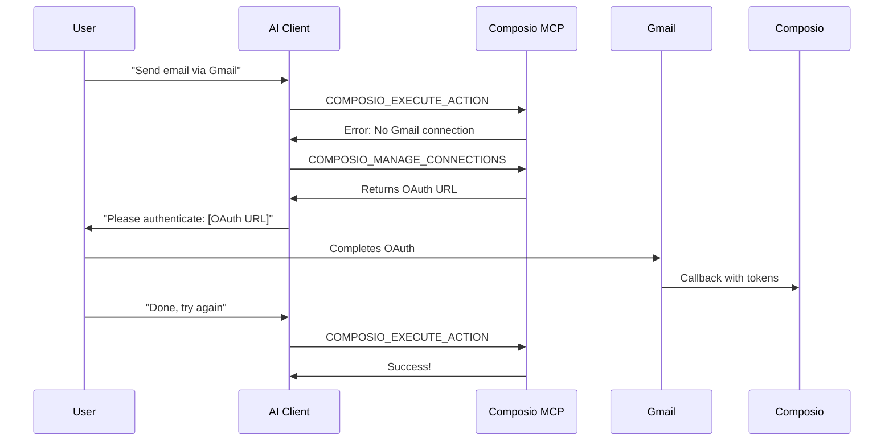

# Composio MCP Integration Guide

## Overview

This guide covers using Composio as an MCP (Model Context Protocol) server, enabling seamless integration with Claude Desktop, Cursor IDE, OpenAI Agents, and any MCP-compatible client.

---

## What is MCP (Model Context Protocol)?

MCP is an open protocol that standardizes how AI applications connect to external tools and data sources. Think of it as a universal adapter between AI models and the real world.

### Key Benefits
- **Standardized Interface**: One protocol, many tools
- **Client Agnostic**: Works with Claude Desktop, Cursor, custom agents
- **Secure**: Authentication handled via headers
- **Composable**: Mix and match multiple MCP servers

### How MCP Works
```
┌─────────────────┐     MCP Protocol     ┌─────────────────┐
│   AI Client     │◄───────────────────►│   MCP Server    │
│ (Claude/Cursor) │                      │   (Composio)    │
└─────────────────┘                      └─────────────────┘
        │                                        │
        │ Tools Request                          │ Execute
        └────────────────────────────────────────┘
```

---

## How Composio Provides MCP Endpoints

Composio acts as an MCP server, exposing its 5 meta tools through the MCP protocol:

### The 5 Meta Tools (via MCP)

| Tool | Purpose |
|------|---------|
| `COMPOSIO_LIST_APPS` | List available apps (Gmail, Slack, etc.) |
| `COMPOSIO_LIST_ACTIONS` | List actions for a specific app |
| `COMPOSIO_MANAGE_CONNECTIONS` | Handle OAuth authentication |
| `COMPOSIO_GET_CONNECTIONS` | Check connection status |
| `COMPOSIO_EXECUTE_ACTION` | Execute any action |

### MCP Server Architecture
```
Composio MCP Server
├── Session Management
│   └── Each session gets unique MCP URL
├── Authentication
│   └── API key via headers or session token
├── Tool Discovery
│   └── Lists available meta tools
└── Tool Execution
    └── Routes to appropriate Composio API
```

---

## Session-Based MCP URLs

Each Composio session provides dedicated MCP endpoints:

### URL Structure
```
Base URL: https://mcp.composio.dev/session/{session_id}
```

### Obtaining MCP Credentials

When you create a Composio session, you receive:

```json
{
  "session": {
    "id": "sess_abc123",
    "mcp": {
      "url": "https://mcp.composio.dev/session/sess_abc123",
      "headers": {
        "Authorization": "Bearer ck_xxxxx",
        "X-Session-Id": "sess_abc123"
      }
    }
  }
}
```

### Session Types

#### 1. Direct API Key Mode
```bash
# MCP URL with API key
URL: https://mcp.composio.dev/composio
Headers:
  X-API-KEY: your_composio_api_key
```

#### 2. Session-Based Mode
```bash
# MCP URL with session
URL: https://mcp.composio.dev/session/{session_id}
Headers:
  Authorization: Bearer {session_token}
```

---

## Connecting to Claude Desktop

### Step 1: Locate Config File

| OS | Path |
|----|------|
| macOS | `~/Library/Application Support/Claude/claude_desktop_config.json` |
| Windows | `%APPDATA%\Claude\claude_desktop_config.json` |
| Linux | `~/.config/Claude/claude_desktop_config.json` |

### Step 2: Add Composio MCP Server

```json
{
  "mcpServers": {
    "composio": {
      "url": "https://mcp.composio.dev/composio",
      "headers": {
        "X-API-KEY": "your_composio_api_key"
      }
    }
  }
}
```

### Step 3: Restart Claude Desktop

After saving the config, restart Claude Desktop to load the MCP server.

### Step 4: Verify Connection

In Claude Desktop, type:
```
List available apps using Composio
```

Claude should use the `COMPOSIO_LIST_APPS` tool.

---

## Connecting to Cursor IDE

### Step 1: Locate Config File

| OS | Path |
|----|------|
| macOS/Linux | `~/.cursor/mcp.json` |
| Windows | `%USERPROFILE%\.cursor\mcp.json` |

### Step 2: Add Composio MCP Server

```json
{
  "mcpServers": {
    "composio": {
      "url": "https://mcp.composio.dev/composio",
      "headers": {
        "X-API-KEY": "your_composio_api_key"
      }
    }
  }
}
```

### Step 3: Enable in Cursor Settings

1. Open Cursor Settings (`Cmd/Ctrl + ,`)
2. Navigate to Features → MCP
3. Enable "Use MCP Servers"
4. Restart Cursor

---

## Connecting to OpenAI Agents SDK

OpenAI's Agents SDK supports MCP servers:

```python
from openai import OpenAI
from openai.agents import Agent, MCPServer

# Create MCP server connection
composio_mcp = MCPServer(
    url="https://mcp.composio.dev/composio",
    headers={
        "X-API-KEY": "your_composio_api_key"
    }
)

# Create agent with MCP tools
agent = Agent(
    name="assistant",
    model="gpt-4",
    mcp_servers=[composio_mcp]
)

# Agent now has access to Composio tools
response = agent.run("Send an email via Gmail")
```

---

## Authentication Flow via MCP

### Initial Setup (No Connections)



### Checking Existing Connections

```
User: "What services am I connected to?"

AI uses: COMPOSIO_GET_CONNECTIONS
Response: ["gmail", "slack", "github"]
```

### Adding New Connections

```
User: "Connect my Notion account"

AI uses: COMPOSIO_MANAGE_CONNECTIONS
Parameters: { "app": "notion" }
Response: { "auth_url": "https://...", "status": "pending" }
```

---

## Configuration Examples

### Minimal Configuration
```json
{
  "mcpServers": {
    "composio": {
      "url": "https://mcp.composio.dev/composio",
      "headers": {
        "X-API-KEY": "ck_your_api_key"
      }
    }
  }
}
```

### With Entity ID (Multi-User)
```json
{
  "mcpServers": {
    "composio": {
      "url": "https://mcp.composio.dev/composio",
      "headers": {
        "X-API-KEY": "ck_your_api_key",
        "X-Entity-ID": "user_123"
      }
    }
  }
}
```

### Session-Based (Temporary)
```json
{
  "mcpServers": {
    "composio": {
      "url": "https://mcp.composio.dev/session/sess_abc123",
      "headers": {
        "Authorization": "Bearer session_token_here"
      }
    }
  }
}
```

---

## Best Practices

### 1. Security

```bash
# ❌ Don't commit API keys
# ✅ Use environment variables
{
  "mcpServers": {
    "composio": {
      "url": "https://mcp.composio.dev/composio",
      "env": {
        "COMPOSIO_API_KEY": "X-API-KEY"
      }
    }
  }
}
```

### 2. Entity Management

For multi-user applications, always specify entity ID:
```json
{
  "headers": {
    "X-API-KEY": "your_key",
    "X-Entity-ID": "unique_user_identifier"
  }
}
```

### 3. Error Handling

Common MCP errors and solutions:

| Error | Cause | Solution |
|-------|-------|----------|
| `401 Unauthorized` | Invalid API key | Check `X-API-KEY` header |
| `404 Not Found` | Invalid session | Create new session |
| `429 Rate Limited` | Too many requests | Implement backoff |
| `Connection refused` | MCP server down | Check Composio status |

### 4. Connection Caching

Connections persist across sessions. Check before creating:
```
1. COMPOSIO_GET_CONNECTIONS → List existing
2. If missing → COMPOSIO_MANAGE_CONNECTIONS
3. If exists → COMPOSIO_EXECUTE_ACTION
```

### 5. Tool Discovery Pattern

```
1. COMPOSIO_LIST_APPS → See available integrations
2. COMPOSIO_LIST_ACTIONS(app: "gmail") → See Gmail actions
3. COMPOSIO_EXECUTE_ACTION → Run specific action
```

---

## Troubleshooting

### Claude Desktop Not Connecting

1. **Check config syntax**: JSON must be valid
2. **Verify file location**: Exact path varies by OS
3. **Check logs**: `~/Library/Logs/Claude/` (macOS)
4. **Restart completely**: Quit and reopen

### Cursor Not Showing Tools

1. **Enable MCP**: Settings → Features → MCP
2. **Check config**: `~/.cursor/mcp.json`
3. **View logs**: Help → Toggle Developer Tools

### "No connection" Errors

1. Run `COMPOSIO_GET_CONNECTIONS` to check status
2. Use `COMPOSIO_MANAGE_CONNECTIONS` to authenticate
3. Complete OAuth in browser
4. Retry original action

### Rate Limiting

Composio MCP has rate limits:
- 100 requests/minute (standard)
- 1000 requests/minute (pro)

Implement exponential backoff:
```python
import time

def call_with_retry(fn, max_retries=3):
    for i in range(max_retries):
        try:
            return fn()
        except RateLimitError:
            time.sleep(2 ** i)
    raise Exception("Max retries exceeded")
```

---

## Advanced Topics

### Custom MCP Wrapper

Create a local MCP proxy for additional functionality:

```python
# mcp_proxy.py
from mcp import Server, Tool

class ComposioProxy(Server):
    def __init__(self, api_key):
        self.api_key = api_key
        
    async def list_tools(self):
        # Add custom tools alongside Composio
        return [
            Tool("custom_tool", ...),
            *await self.get_composio_tools()
        ]
```

### Multi-Server Setup

Combine Composio with other MCP servers:

```json
{
  "mcpServers": {
    "composio": {
      "url": "https://mcp.composio.dev/composio",
      "headers": { "X-API-KEY": "..." }
    },
    "filesystem": {
      "command": "npx",
      "args": ["-y", "@modelcontextprotocol/server-filesystem"]
    },
    "github": {
      "command": "npx", 
      "args": ["-y", "@modelcontextprotocol/server-github"]
    }
  }
}
```

### Webhooks & Real-time

For real-time updates, combine MCP with webhooks:

```python
# Configure webhook for action completion
composio.configure_webhook(
    url="https://your-app.com/webhook",
    events=["action.completed", "connection.created"]
)
```

---

## Quick Reference

### MCP URLs
| Type | URL Pattern |
|------|-------------|
| Standard | `https://mcp.composio.dev/composio` |
| Session | `https://mcp.composio.dev/session/{id}` |
| Self-hosted | `https://your-domain.com/mcp` |

### Required Headers
| Header | Purpose |
|--------|---------|
| `X-API-KEY` | Composio API key |
| `X-Entity-ID` | User identifier (optional) |
| `Authorization` | Session token (session mode) |

### Meta Tools
| Tool | Input | Output |
|------|-------|--------|
| `COMPOSIO_LIST_APPS` | None | App list |
| `COMPOSIO_LIST_ACTIONS` | `app` | Action list |
| `COMPOSIO_MANAGE_CONNECTIONS` | `app` | Auth URL |
| `COMPOSIO_GET_CONNECTIONS` | None | Connection list |
| `COMPOSIO_EXECUTE_ACTION` | `action`, `params` | Result |

---

## Resources

- [MCP Protocol Spec](https://modelcontextprotocol.io/)
- [Composio Documentation](https://docs.composio.dev/)
- [Claude Desktop MCP Guide](https://docs.anthropic.com/claude/docs/mcp)
- [Cursor MCP Setup](https://cursor.sh/docs/mcp)
